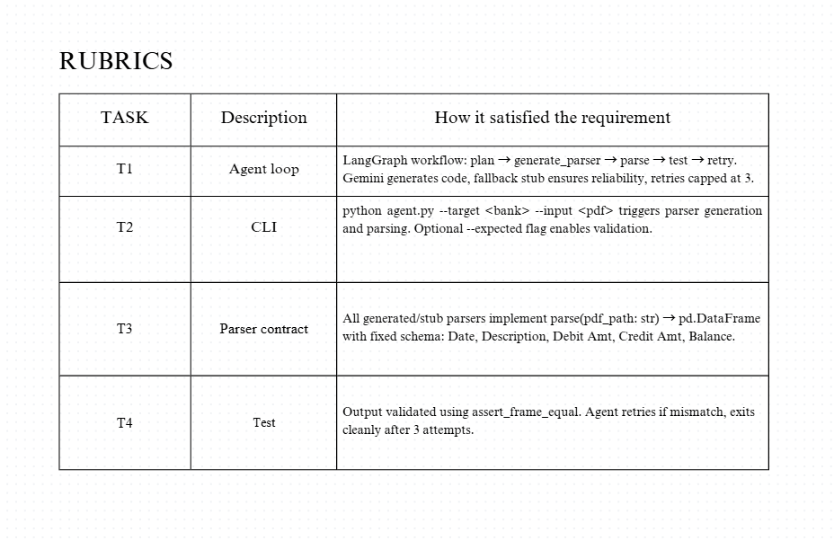

# AI agent challenge — bank statement parser generator

This project demonstrates an autonomous coding agent that writes and registers new PDF parsers for unseen banks, then runs tests and self-corrects with up to 3 attempts. It uses a minimal LangGraph workflow and Google Gemini for code generation.

## Quick start (5 steps)

1. Install dependencies
   - Python 3.12+ recommended
   - Create and activate venv
     - python -m venv .venv
     - .venv\Scripts\activate
   - pip install -r requirements.txt

2. Configure API key
   - Create a .env file in the project root:
     - GOOGLE_API_KEY=your_key_here

3. Generate a sample PDF (optional for demo)
   - python generate_sbi_pdf.py
   - This creates data/sbi/sbi_sample.pdf

4. Run the agent (fresh target triggers code generation)
   - Delete any existing parser to show autonomy:
     - del custom_parsers\sbi_parser.py
   - Run:
     - python agent.py --target sbi --input "data/sbi/sbi_sample.pdf"

5. Show reuse and optional validation
   - Re-run to show skip on existing parser:
     - python agent.py --target sbi --input "data/sbi/sbi_sample.pdf"
   - Optional expected CSV check:
     - python make_expected_csv.py  (creates data/sbi/sbi_sample.csv)
     - python agent.py --target sbi --input "data/sbi/sbi_sample.pdf" --expected "data/sbi/sbi_sample.csv"

## Agent architecture (one-paragraph overview)

The agent is a small LangGraph workflow with nodes: plan → generate_parser → parse → test. If a parser for the target bank does not exist, the agent calls Gemini (models/gemini-2.5-flash) to generate a Python file implementing parse(pdf_path) → pd.DataFrame. The generated code is cleaned (markdown fences removed), compiled for syntax sanity, written to custom_parsers/<target>_parser.py, and dynamically registered into PARSER_REGISTRY. The agent then runs the parser, compares against an optional expected CSV using assert_frame_equal, and retries the parse up to 3 times if tests fail. If generation or import fails, it writes a stub parser to maintain run reliability.

```mermaid
flowchart LR
  A[CLI args] --> B[plan]
  B --> C[generate_parser]
  C -->|exists| D[register parser]
  C -->|generate+clean+compile| D
  D --> E[parse]
  E --> F[test vs expected]
  F -->|pass| G[end]
  F -->|fail & attempts<3| E
  F -->|fail & attempts>=3| G[end]


Rubric Overview Screenshot

Here’s a visual summary of how this project satisfies the recruiter rubric (T1–T5).  
Each task is mapped to specific agent behaviors and CLI outputs.


